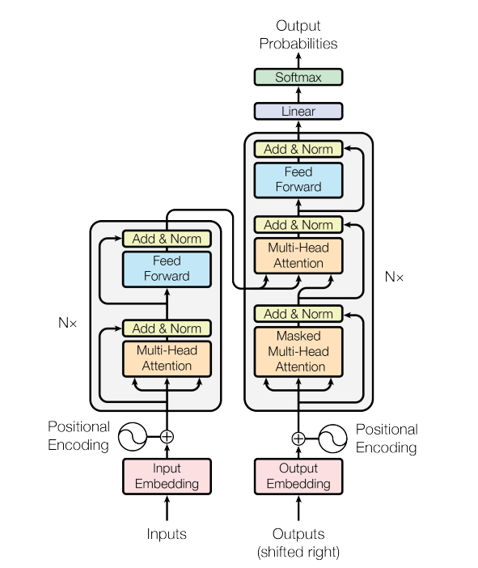
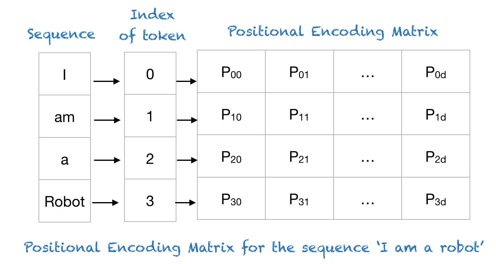
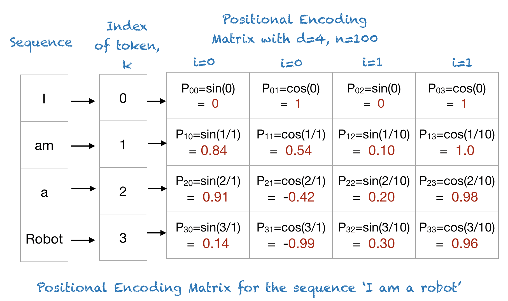
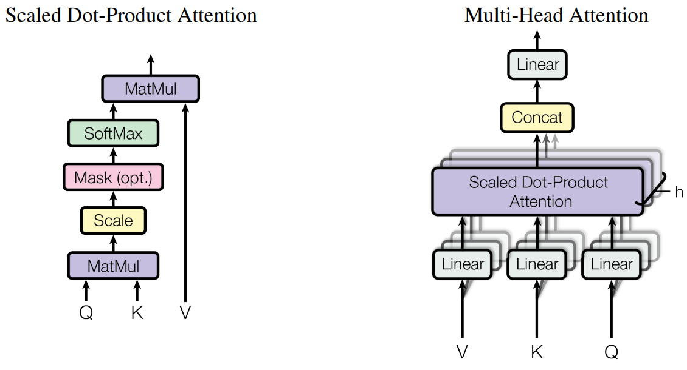

# Transformers for sentiment analysis

```{python}
import torch
import torch.nn as nn
import torch.nn.functional as F
from torch.utils.data import DataLoader, TensorDataset
import torch.optim as optim
import numpy as np
```

## Download the dataset

```{python}
import tensorflow as tf
imdb = tf.keras.datasets.imdb
vocab_size = 20000  # Only consider the top 20k words
(x_train, y_train), (x_test, y_test) = imdb.load_data(num_words=vocab_size)

print("Number of training samples:", len(x_train))
print("Number of test samples:", len(x_test))
```

```{python}
print(x_train[0:5])
print(y_train[0:5])
```

```{python}
# Retrieve the dictionary which maps words to indices.
word_to_integer = imdb.get_word_index()
list(word_to_integer.items())[0:5]
```

```{python}
# Build a new dictionary which reverses the mapping, i.e. (index, word)
integer_to_word = dict([(value, key) for (key, value) in word_to_integer.items()])
list(integer_to_word.items())[0:5]
```

```{python}
# Print out a review
for n in range(5):
    decoded_review = [integer_to_word.get(i - 3,'pad') for i in x_train[n]]

    if y_train[n]==0:
        print("Negative review: \n", end="")
    else:
        print("Positive review: \n", end="")

    for word in decoded_review:
        if word == 'pad':
            continue
        print(word, end=" ")
    print("\n")
```

Convert text data to a fixed length:
* Truncate long reviews (cut words at the front)
* Pad short reviews (add zeros at the front)

```{python}
def pad_sequences(sequences, maxlen):
    # Truncate long reviews to length of 'maxlen'
    tensor_sequences = [torch.tensor(seq, dtype=torch.long)[-maxlen:] for seq in sequences]
    # Pad short reviews to length of 'maxlen' (add 0 at the beginning)
    return torch.nn.utils.rnn.pad_sequence(tensor_sequences, batch_first=True, padding_side="left")

max_length = 256  # Fix each movie review to be a length of 256 words
x_train = pad_sequences(x_train, max_length)
x_test  = pad_sequences(x_test,  max_length)
```

## Build a transformer

Transformer architecture:



Input embedding: The IMDB dataset downloaded from Keras has already converted text to integer, and we have set the length of input embeddings as 256.

### Positional encoding



The positional encoding is given by sine and cosine functions of varying frequencies:

$$P(k,2i) = \sin\left(\frac{k}{n^{2i/d}}\right)$$

$$P(k,2i+1) = \cos\left(\frac{k}{n^{2i/d}}\right),$$

where
* $P(k,j)$: Position function for mapping a position $k$ in the input sequence to index $(k,j)$ of the positional matrix;
* $d$: Dimension of the output embedding space (set to be same as the dimension of the input embedding space in [1](https://arxiv.org/pdf/1706.03762));
* $n$: vocabulary size (set to 10,000 in [1](https://arxiv.org/pdf/1706.03762));
* $i$: Used for mapping to column indices, with a single value of maps to both sine and cosine functions.



```{python}
K = 100
d = 512
n = 10000

P = np.zeros((K, d))
for k in range(K):
    for i in range(int(d/2)):
        P[k,2*i] = np.sin(k/np.power(n,2*i/d))
        P[k,2*i+1] = np.cos(k/np.power(n,2*i/d))

import matplotlib.pyplot as plt
cax = plt.matshow(P)
plt.title("The positional encoding matrix for n=10,000, d=512, sequence length=100")
plt.gcf().colorbar(cax)
```

Reference:

[1] [Attention is All You Need](https://arxiv.org/abs/1706.03762)

[2] [A Gentle Introduction to Positional Encoding in Transformer Models](https://machinelearningmastery.com/a-gentle-introduction-to-positional-encoding-in-transformer-models-part-1/)

```{python}
class PositionalEncoding(nn.Module):

    def __init__(self, max_len, dmodel, dropout):
        # max_len: The maximum expected sequence length.
        # dmodel: Dimensionality of the input embedding vector.
        # dropout: Probability of an element of the tensor to be zeroed.

        super(PositionalEncoding, self).__init__()

        self.dropout = nn.Dropout(dropout)

        # Create pos_encoding, positions and dimensions matrices
        # with a shape of (max_len, dmodel)
        self.pos_encoding = torch.zeros(max_len, dmodel)
        positions = torch.repeat_interleave(torch.arange(float(max_len)).unsqueeze(1), dmodel, dim=1)
        dimensions = torch.arange(float(dmodel)).repeat(max_len, 1)

        # Calculate the encodings trigonometric function argument (max_len, dmodel)
        trig_fn_arg = positions / (torch.pow(10000, 2 * dimensions / dmodel))

        # Encode positions using sin function for even dimensions and
        # cos function for odd dimensions
        self.pos_encoding[:, 0::2] = torch.sin(trig_fn_arg[:, 0::2])
        self.pos_encoding[:, 1::2] = torch.cos(trig_fn_arg[:, 1::2])

        # Add batch dimension
        self.pos_encoding = self.pos_encoding.unsqueeze(0)


    def forward(self, embedd):
        # embedd: Batch of word embeddings (batch_size, seq_length, dmodel = embedding_dim)

        # Sum up word embeddings and positional embeddings (batch_size, seq_length, dmodel)
        embedd = embedd + self.pos_encoding[:, :embedd.size(1), :]
               # embedd shape (batch_size, seq_length, embedding_dim)
               # pos_encoding shape (1, max_len, dmodel = embedd_dim)
        embedd = self.dropout(embedd)

        # embedd shape (batch_size, seq_length, embedding_dim)
        return embedd
```

### Multi-head attention


The formula for attention is given by:

$$\text{Attention}(Q,K,V)=\text{softmax}(\frac{QK^\top}{\sqrt{d_k}})V,$$

where
* $Q,K,V$ stands for the query, key and value matrices;
* $d_k$ is the dimensionality of $Q,K,V$ matrices (number of columns).

<br>

In the case of self-attention, $Q,K,V$ are obtained as:

$$Q = X W^Q, k = X W^K, V = X W^V,$$

where $X$ is the input and $W^Q, W^K, W^V \in \mathbb{R}^{d_\text{input} \times d_k}$ are projection matrices that are initialised randomly and learned during training.

<br>

Instead of performing a single attention function, multi-head attention allows the model to jointly attend to information from different representation subspaces at different positions:

$$\begin{split}
\text{MultiHead}(Q,K,V)&=\text{Concat}(\text{head}_1,\cdots, \text{head}_h)W^O \\
\text{where } \text{head}_i &= \text{Attention}(X W^Q_i, X W^K_i, X W^V_i)
\end{split}$$



```{python}
### Attention
from numpy import random
from scipy.special import softmax

# input = x_train_subset[0:5]
input = random.rand(5, max_length)
d_input = max_length # 256
d_k = 16
W_Q = random.rand(d_input, d_k); Q = np.matmul(input, W_Q)
W_V = random.rand(d_input, d_k); V = np.matmul(input, W_V)
W_K = random.rand(d_input, d_k); K = np.matmul(input, W_K)

Weights = softmax(np.matmul(Q, np.transpose(K)) / np.sqrt(d_k), axis=1)
Attention = np.matmul(Weights, V)
Attention
```

```{python eval=FALSE}
import math

class MultiHeadAttention(nn.Module):
    def __init__(self, d_model, num_heads):
        super(MultiHeadAttention, self).__init__()
        # Ensure that the model dimension (d_model) is divisible by the number of heads
        assert d_model % num_heads == 0, "d_model must be divisible by num_heads"

        # Initialize dimensions
        self.d_model = d_model # Model's dimension
        self.num_heads = num_heads # Number of attention heads
        self.d_k = d_model // num_heads # Dimension of each head's key, query, and value

        # Linear layers for transforming inputs
        self.W_q = nn.Linear(d_model, d_model) # Query transformation
        self.W_k = nn.Linear(d_model, d_model) # Key transformation
        self.W_v = nn.Linear(d_model, d_model) # Value transformation
        self.W_o = nn.Linear(d_model, d_model) # Output transformation

    def scaled_dot_product_attention(self, Q, K, V, mask=None):
        # Calculate attention scores
        attn_scores = torch.matmul(Q, K.transpose(-2, -1)) / math.sqrt(self.d_k)

        # Apply mask if provided (useful for preventing attention to certain parts like padding)
        if mask is not None:
            attn_scores = attn_scores.masked_fill(mask == 0, -1e9)

        # Softmax is applied to obtain attention probabilities
        attn_probs = torch.softmax(attn_scores, dim=-1)

        # Multiply by values to obtain the final output
        output = torch.matmul(attn_probs, V)
        return output

    def split_heads(self, x):
        # Reshape the input to have num_heads for multi-head attention
        batch_size, seq_length, d_model = x.size()
        return x.view(batch_size, seq_length, self.num_heads, self.d_k).transpose(1, 2)

    def combine_heads(self, x):
        # Combine the multiple heads back to original shape
        batch_size, _, seq_length, d_k = x.size()
        return x.transpose(1, 2).contiguous().view(batch_size, seq_length, self.d_model)

    def forward(self, Q, K, V, mask=None):
        # Apply linear transformations and split heads
        Q = self.split_heads(self.W_q(Q))
        K = self.split_heads(self.W_k(K))
        V = self.split_heads(self.W_v(V))

        # Perform scaled dot-product attention
        attn_output = self.scaled_dot_product_attention(Q, K, V, mask)

        # Combine heads and apply output transformation
        output = self.W_o(self.combine_heads(attn_output))
        return output
```

### Transformer network

```{python}
class TransformerBlock(nn.Module):
    """
    Transformer block structure:
    x --> Multi-Head --> Layer normalization --> Pos-Wise FFNN --> Layer normalization --> y
      |   Attention   |                       |                 |
      |_______________|                       |_________________|
     residual connection                      residual connection
    """

    def __init__(self, dmodel, ffnn_hidden_size, heads, dropout):
        # dmodel: Dimensionality of the input embedding vector.
        # ffnn_hidden_size: Position-Wise-Feed-Forward Neural Network hidden size.
        # heads: Number of the self-attention operations to conduct in parallel.
        # dropout: Probability of an element of the tensor to be zeroed.

        super(TransformerBlock, self).__init__()

        # For MHA, use the default function from torch.nn or the previously built class
        self.attention = nn.MultiheadAttention(dmodel, heads, batch_first=True)
        # self.attention = MultiHeadAttention(dmodel, heads)
        self.layer_norm1 = nn.LayerNorm(dmodel)
        self.layer_norm2 = nn.LayerNorm(dmodel)
        self.ffnn = nn.Sequential(
                nn.Linear(dmodel, ffnn_hidden_size),
                nn.ReLU(),
                nn.Dropout(dropout),
                nn.Linear(ffnn_hidden_size, dmodel))

    def forward(self, inputs):
        # inputs: Batch of embeddings; shape: (batch_size, seq_length, embedding_dim = dmodel)

        output, _ = self.attention(inputs, inputs, inputs) # self-attention: same input for K,Q,V
        output = inputs + output
        output = self.layer_norm1(output)
        output = output + self.ffnn(output)
        output = self.layer_norm2(output)

        return output #shape: (batch_size, seq_length, dmodel)


class Transformer(nn.Module):

    def __init__(self, vocab_size, dmodel, max_len, n_layers=4,
                 ffnn_hidden_size=None, heads=8, dropout=0.2):
    # vocab_size: The size of the vocabulary.
    # dmodel: Dimensionality of the embedding vector.
    # max_len: The maximum expected sequence length.
    # n_layers: Number of the stacked Transformer blocks.
    # ffnn_hidden_size: Position-Wise-Feed-Forward Neural Network hidden size.
    # heads:  Number of the self-attention operations to conduct in parallel.
    # dropout: Probability of an element of the tensor to be zeroed.

        super(Transformer, self).__init__()

        if not ffnn_hidden_size:
            ffnn_hidden_size = dmodel * 4

        self.embedding = nn.Embedding(vocab_size, dmodel)

        self.pos_encoding = PositionalEncoding(max_len, dmodel, dropout)

        self.tnf_blocks = nn.ModuleList()

        for n in range(n_layers):
            self.tnf_blocks.append(
                TransformerBlock(dmodel, ffnn_hidden_size, heads, dropout))

        self.tnf_blocks = nn.Sequential(*self.tnf_blocks)

        self.linear = nn.Linear(dmodel, 2)

    def forward(self, inputs): # inputs shape: (batch_size, seq_length, dmodel)
        self.batch_size = inputs.size(0)

        output = self.embedding(inputs)
        output = self.pos_encoding(output)
        output = self.tnf_blocks(output) # output shape: (batch_size, seq_length, dmodel)

        # Apply max-pooling; output shape: (batch_size, dmodel)
        output = F.adaptive_max_pool1d(output.permute(0,2,1), (1,)).view(self.batch_size,-1)

        output = self.linear(output)

        return F.softmax(output, dim=-1)
```

```{python}
model = Transformer(vocab_size=20000, dmodel=32, max_len=256,
                    n_layers=1, heads=4, dropout=0.2)
```

## Train and evaluate the transformer

```{python eval=FALSE}
# Create DataLoader
batch_size = 32
train_loader = DataLoader(TensorDataset(x_train, torch.tensor(y_train)), batch_size=batch_size, shuffle=True)
test_loader = DataLoader(TensorDataset(x_test, torch.tensor(y_test)), batch_size=batch_size, shuffle=True)
```

```{python eval=FALSE}
# Train the transformer
optimizer = optim.Adam(model.parameters(), lr=0.001) # ADAM optimiser with learning rate of 0.001
criterion = nn.CrossEntropyLoss() # Loss function: cross-entropy
num_epochs = 1 # Total number of epochs
loss_history = [] # List to store the loss

for epoch in range(num_epochs):
    iteration = 0  # Track total iterations across epochs
    for batch_x, batch_y in train_loader:
        optimizer.zero_grad()
        outputs = model(batch_x)
        loss = criterion(outputs, batch_y)
        loss.backward()
        optimizer.step()

        loss_history.append(loss.item())
```

```{python eval=FALSE}
import matplotlib.pyplot as plt
plt.plot(loss_history)
plt.show()
```

```{python eval=FALSE}
predictions = []  # To store predictions

model.eval()
with torch.no_grad():
    for batch in test_loader:
        x_batch, _ = batch
        batch_predictions = model(x_batch)
        predictions.append(batch_predictions)

# Concatenate all predictions into a single tensor, then convert to NumPy
predictions = torch.cat(predictions).numpy()
```

```{python eval=FALSE}
incorrectlist = np.where(np.argmax(predictions,axis=-1)!=y_test)[0]
incorrectscores = predictions[np.argmax(predictions,axis=-1)!=y_test]

mostpositiveincorrectscore = incorrectlist[np.argmax(incorrectscores[:,1])]
mostnegativeincorrectscore = incorrectlist[np.argmin(incorrectscores[:,1])]

correctlist = np.where(np.argmax(predictions,axis=-1)==y_test)[0]
correctscores = predictions[np.argmax(predictions,axis=-1)==y_test]

mostpositivecorrectscore = correctlist[np.argmax(correctscores[:,1])]
mostnegativecorrectscore = correctlist[np.argmin(correctscores[:,1])]

indexes = [mostpositiveincorrectscore, mostnegativeincorrectscore,
                      mostpositivecorrectscore,mostnegativecorrectscore]

for n in indexes:
    decoded_review = [integer_to_word.get(i - 3,'pad') for i in x_test[n].numpy()]

    if y_test[n]==0:
        print("Negative review with scores ", end="")
        print(predictions[n][0], predictions[n][1])
    else:
        print("Positive review with scores ", end="")
        print(predictions[n][0], predictions[n][1])
    for word in decoded_review:
        if word == 'pad':
            continue
        print(word, end=" ")
    print("\n")
```

